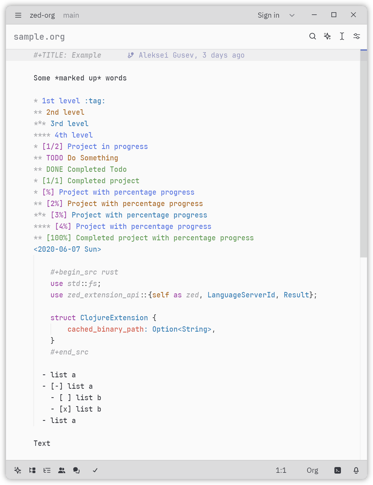

# Zed Org Mode

Org Mode support for Zed.



## Features

- **Syntax Highlighting**: Full syntax highlighting for org-mode files with semantic TODO keyword colors
- **TODO Keywords**: Support for TODO, NEXT, STARTED, IN-PROGRESS, WAITING, HOLD, DONE, CANCELLED, and more
- **Checkbox Toggle**: Interactive checkbox toggling via code actions
- **Code Blocks**: Syntax highlighting for embedded code blocks
- **Outline Navigation**: Navigate your org files by heading structure

## TODO Keyword Colors

- **Active states**: TODO, NEXT (orange)
- **In-progress states**: IN-PROGRESS, INPROGRESS (light green)
- **Started states**: STARTED
- **Waiting/blocked states**: WAITING, HOLD, DELEGATED
- **Low priority states**: MAYBE, SOMEDAY
- **Note/information**: NOTE
- **Completed states**: DONE
- **Cancelled states**: CANCELLED, CANCELED, DEFERRED

## Checkbox Toggle

Toggle checkboxes between states: `[ ]` → `[x]` → `[-]` → `[ ]`

To set up a keyboard shortcut (recommended: `Alt+C`), see [KEYMAP_SETUP.md](KEYMAP_SETUP.md).

## Installation

### Quick Start (No Rust Required!)

1. Open Zed editor
2. Go to Extensions (Ctrl+Shift+X / Cmd+Shift+X)
3. Click "Install Dev Extension"
4. Navigate to and select this directory

**That's it!** Zed will automatically compile the Rust extension for you.

### Setting Up Checkbox Toggle

After installing the extension, set up the `Alt+C` shortcut to toggle checkboxes directly:

1. Press `Ctrl+K` then `Ctrl+S` (or `Cmd+K` `Cmd+S` on macOS)
2. Add this to your keymap:

```json
[
  {
    "context": "Editor && mode == full",
    "bindings": {
      "alt-c": "editor::ConfirmCodeAction"
    }
  }
]
```

Now pressing `Alt+C` will instantly toggle the checkbox without showing a menu!

See [KEYMAP_SETUP.md](KEYMAP_SETUP.md) for more options and troubleshooting.

## Development

### For Language Server Development

If you want to modify the language server:

```bash
cd language-server
npm install
```

After making changes, just reload Zed to pick up the updates.

### For Extension Development (Advanced)

Only needed if you're modifying the Rust extension code:

```bash
# Install Rust
curl --proto '=https' --tlsv1.2 -sSf https://sh.rustup.rs | sh

# Build manually (optional - Zed does this automatically)
cargo build --release
```

### Testing

1. Use "Install Dev Extension" in Zed's extensions page
2. Point it to this directory
3. Open a `.org` file to test features
4. For debugging: Run `zed --foreground` in terminal for verbose logs

## License

This project is licensed under the [MIT License](LICENSE).
